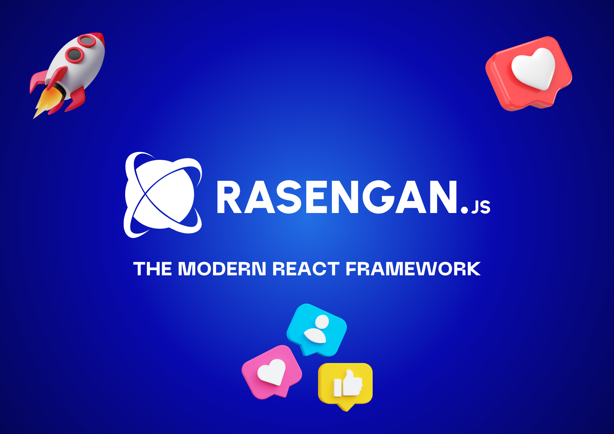

## Getting Started

Based on modern tools, Rasengan.js will help you to create **high-quality web applications** with the benefit of React Components. It's a simple and easy-to-use framework that will help you to create a **beautiful and responsive web application**.

- Visit the [Rasengan.js Showcase](https://rasengan.dev/showcase) to see more sites built with Rasengan.js.
- Visit the [Rasengan.js Blog](https://rasengan.dev/blog) to get all news related to Rasengan.js.

## Documentation

Visit [https://rasengan.dev/docs](https://rasengan.dev/docs) to view the full documentation.

## Community

The Rasengan.js community can be found on [GitHub Discussions](https://github.com/rasengan-dev/rasenganjs/discussions) where you can ask questions, voice ideas, and share your projects with other people.

We also have a [Twitter](https://twitter.com/rasenganjs) account where you can follow us to get the latest news about Rasengan.js.

## License

Rasengan.js is [MIT licensed](https://github.com/rasengan-dev/rasenganjs/blob/main/LICENSE).

## Contributing

We are open to all contributions. If you want to contribute to Rasengan.js, please read the [Contributing Guide](https://github.com/rasengan-dev/rasenganjs/blob/main/CONTRIBUTING.md) to get started.

## Authors

Here are the authors of Rasengan.js, the people who are at the origin of this great framework:

- Dilane Kombou ([**@dilanekombou**](https://twitter.com/dilanekombou))
